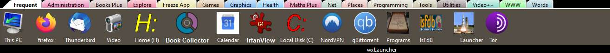

# wxLauncher
Tabbed Launch Bar (Not to be confused with Lunch Bar)

For a long time I used Object Dock from Stardock. However it started causing other desktop tools to misbehave so I started to look for an alternative. 

According to Google there are a number of replacements but none were suitable. The best was 'RocketDock', however I could never get it to behave as I wanted.

Consequently I set off experimenting with Python tools to see how far I could go. The result is this app, written in Python 3.8 using an augmented Anaconda Distribution. It provides a tabbed bar that sits at the top of my screen. Each tab has a collection of icons which launche tools. It should be almost platform neutral and is 100% Python.

Tabs and Tools are created vis drag and drop and context menus. It is configured by an .ini file which is updated to reflect changes made when live. It also supports drag and drop from explorer, desktop and any other source.

One of the most useful features is it keeping track of usage and sorting by most frequently used from the left of the bar. In addition the most frequently used tools are gathered to a tab labelled 'Frequent' for easy access.

Current problems include the limited ability of setting up tools dragged onto a tab. Icons have to be manually set and other parameters edited. I'm currently using the app and recording errors. This is work in progress. Aditionally it does not always save status after changes, do a manual close before shutting down your computer.

I have not included a screenshot, again this is work in progress.

I have added a .ini file, appropriate icons and some short cuts. I found that when links were dropped from the desktop they were oftem moved or deleted (by me). I started using a shortcuts directory to preserve links. This must be manually setup, as are icons.

As is the program stands a good chance of working out of the box but the .ini file should reflect your computer not mine.
